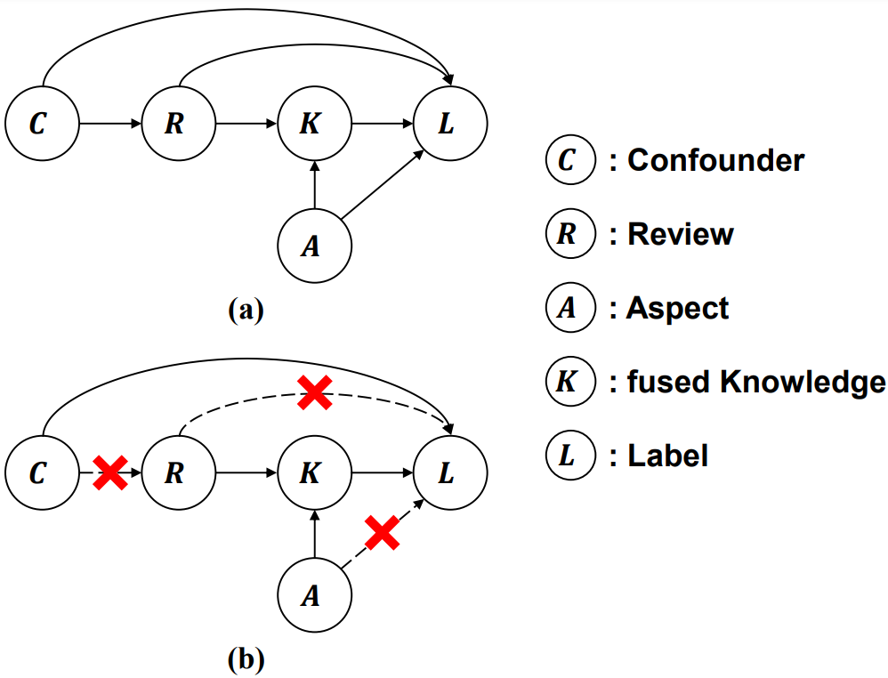
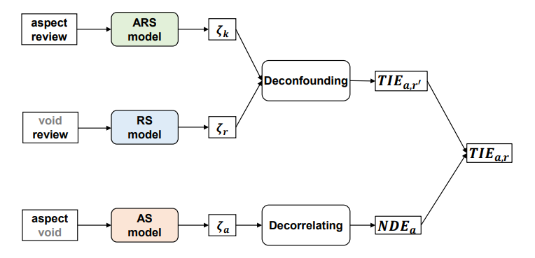

# AfriDINER: Debiasing Aspect-based Sentiment Analysis with Multi-variable Causal Inference for African Languages

## Overall

The SCM of ABSA, which is formulated as a directed acyclic graph, is shown in (a). With the SCM defined, we can derive the formula of causal effect for African language contexts.
As shown in (b), the desired situation for ABSA is that the edges that bring biases are all blocked, which is particularly crucial for African languages where cultural and linguistic biases may be present in limited training data.

<p align="center"> </p>

We present AfriDINER, an adaptation of the DINER debiasing framework for multi-variable causal inference in African language sentiment analysis.

<p align="center"> </p>


## Supported Models
- `XLMr`: Cross-lingual RoBERTa baseline
- `Afro-XLMr`: Afro-XLMR Large model optimized for African languages  
- `Afro-XLMr-large`: Afro-XLMR Large 76-layer variant

## Datasets
- `afi_rest`: African restaurant domain sentiment analysis
- `afri_latop`: African laptop domain sentiment analysis

## Run
Our experiments are carried out with an NVIDIA A100 80GB GPU.

**Note:** Model selection is configured in `run_diner.sh`. Edit the shell script to choose which model to run experiments with.

```bash
cd src
bash run_diner.sh ${dataset_name}
```

## Acknowledgement
This work is implemented based on [ARTS](https://github.com/zhijing-jin/ARTS_TestSet), [cfvqa](https://github.com/yuleiniu/cfvqa), and [CCD](https://github.com/farewellthree/Causal-Context-Debiasing). We also acknowledge the Afro-XLMR model developers for their contributions to African NLP research. Sincere thanks for their efforts.

## ⚠️ Caution
This repo is current a work on progress

## Citation
```
@misc{wu2024diner,
    title={DINER: Debiasing Aspect-based Sentiment Analysis with Multi-variable Causal Inference},
    author={Jialong Wu and Linhai Zhang and Deyu Zhou and Guoqiang Xu},
    year={2024},
    eprint={2403.01166},
    archivePrefix={arXiv},
    primaryClass={cs.CL}
}
```